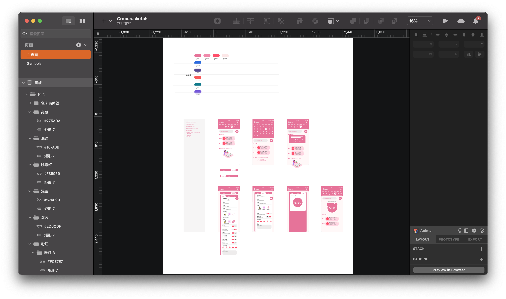
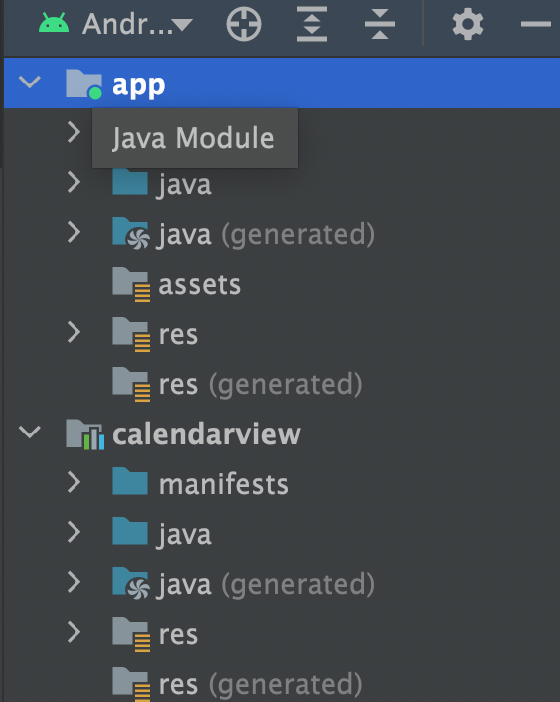
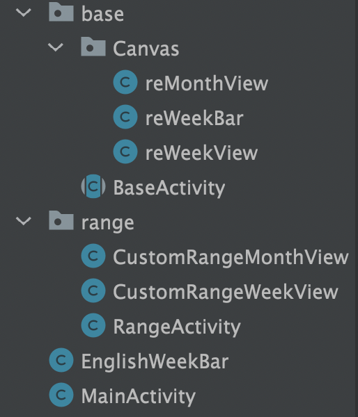
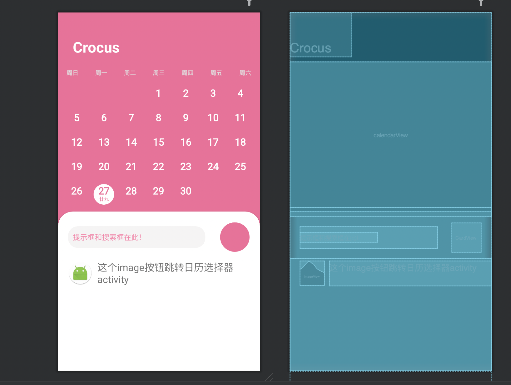

# Readme
注：切换到master分支查看代码文件
# crocus
## app Design

## 主要实现
* listView记录
* 为两种不同的方式添加不同的记录方式（封装共同方法）
* 添加计时器 并调动watch应用记录身体状态
* 精美动画实现（无涉及控件动画使用json）
* 精美插图绘制、并实现控件动画，能使用canvas和animation的情况下，不允许使用drawable

## 代码块 

### 目录

* calendarview为开源库
* app实现软件功能、尽量纯代码

#### Java解释

* base和range同为一个包属
* Canvas用于绘制页面
* Canvas中reMonthView实现月视图
* Canvas中reWeekView实现周视图
* Canvas中reWeekBar实现周视图顶部的星期栏
* range实现月视图、周视图、星期栏、英文星期栏View的绘制

### 已实现功能
* 实现上下滑动切换日历周视图和月视图
* 实现左右滑动切换月视图月份
* 日历视图 如图：

* 无版本号 仅为测试